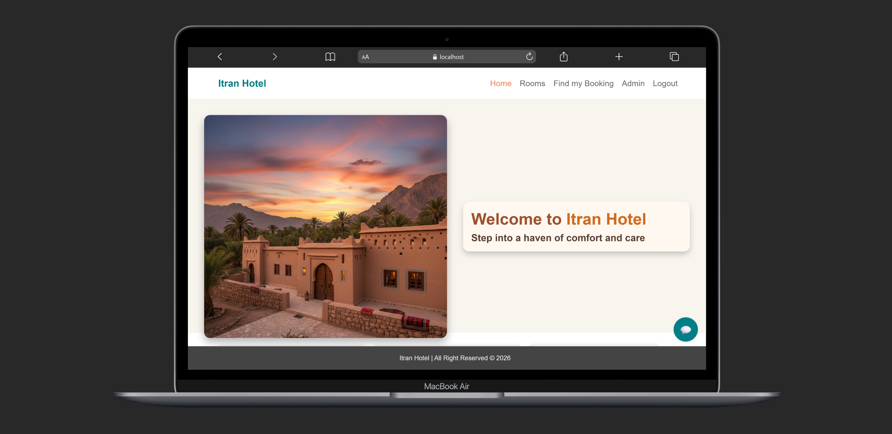
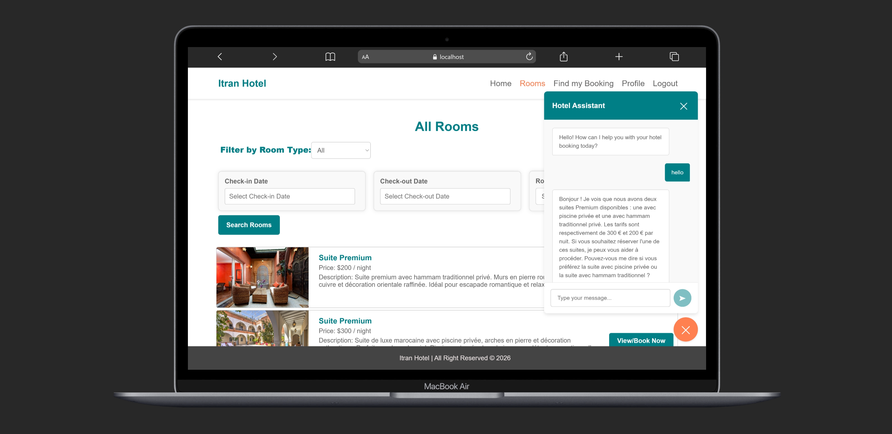

# Itran Hotel

A comprehensive web application for hotel management and booking system named **Itran Hotel**. It includes two main components:
- **Backend**: Built with **Spring Boot** (Java)
- **Frontend**: Built with **React.js**

## Table of Contents
- [Features](#features)
- [Project Architecture](#project-architecture)
- [Installation and Setup](#installation-and-setup)
    - [Backend Spring Boot](#backend-spring-boot)
    - [Frontend React.js](#frontend-reactjs)
- [Module Overview](#module-overview)
- [Main Dependencies](#main-dependencies)
- [Screenshots](#screenshots)
- [Credits](#credits)

---

## Features

### User Authentication & Authorization
- User registration and login
- Admin and user role management
- Secure authentication with Spring Security and JWT tokens
- Profile management for users

### Room Management
- Browse all available rooms with detailed information
- Filter rooms by type (Suite Premium, Standard, etc.)
- Search rooms by check-in and check-out dates
- View room details including price, description, and amenities
- Real-time room availability checking

### Booking System
- Book rooms with date selection
- Find existing bookings using confirmation codes
- View booking history and details
- Modify or cancel reservations
- Booking confirmation and management

### Admin Dashboard
- Add new rooms with images and details
- Edit and update existing room information
- Delete rooms from the system
- Manage all customer bookings
- View and edit booking details
- Monitor hotel occupancy and reservations

### AI-Powered Hotel Assistant (Chatbot)
- Intelligent chatbot for customer support
- Multilingual support (French, English, etc.)
- Helps users with:
  - Room availability inquiries
  - Booking assistance
  - Hotel information
  - Price comparisons
  - Reservation recommendations
- Real-time conversation interface
- Context-aware responses

### User Interface
- Responsive design for all devices
- Intuitive navigation menu
- Modern and clean interface
- Date picker for booking dates
- Room type filtering
- Image galleries for rooms
- Professional footer with copyright information

## Architecture de projet 


## Installation and Setup

### Backend Spring Boot

1. Navigate to the backend directory:
   ```bash
   cd StarHotel/StarHotel
   ```
2. Configure the database in `application.properties` (connection variables, etc.).
3. Build and start the API:
   ```bash
   ./mvnw spring-boot:run
   ```
   The backend will typically run on `http://localhost:8085` (or the configured port).

### Frontend React.js

1. Navigate to the frontend directory:
   ```bash
   cd frontend
   ```
2. Install npm dependencies:
   ```bash
   npm install
   ```
3. Start the development server:
   ```bash
   npm start
   ```
   The frontend will be accessible by default at `http://localhost:3000`

## Module Overview

### Frontend Components

#### Home & Presentation
- **HomePage.jsx** - Landing page with hero image and welcome message
- **style.css** - Custom styling for home page

#### Room Browsing & Booking
- **AllRoomsPage.jsx** - Display all available rooms with filters
- **RoomSearch.jsx** - Search component with date pickers and filters
- **RoomResult.jsx** - Room listing results display
- **RoomDetailsPage.jsx** - Detailed room information and booking
- **FindBookingPage.jsx** - Search for existing bookings
- **BookingResult.jsx** - Booking confirmation and details

#### User Authentication
- **LoginPage.jsx** - User login interface
- **RegisterPage.jsx** - New user registration

#### Admin Management
- **AdminPage.jsx** - Admin dashboard
- **AddRoomPage.jsx** - Add new rooms to the system
- **EditRoomPage.jsx** - Edit existing room details
- **ManageRoomPage.jsx** - Room management interface
- **ManageBookingsPage.jsx** - View and manage all bookings
- **EditBookingPage.jsx** - Modify booking details

#### User Profile
- **ProfilePage.jsx** - User profile information
- **EditProfilePage.jsx** - Update user profile

#### Common Components
- **Navbar.jsx** - Navigation bar with menu items
- **Footer.jsx** - Footer with copyright information
- **ChatBot.jsx** - AI-powered hotel assistant
- **ChatBot.css** - Chatbot styling
- **Pagination.jsx** - Pagination for room listings

#### Services
- **ApiService.js** - API calls and backend integration
- **guard.js** - Route protection and authorization

### Backend Structure

#### Controllers
- REST API endpoints for rooms, bookings, users, and authentication

#### Services
- Business logic implementation
- Room management service
- Booking service
- User service
- Authentication service

#### Entities
- Room entity
- Booking entity
- User entity
- Role entity

#### Repositories
- JPA repositories for database operations

#### Security
- JWT token generation and validation
- Spring Security configuration
- User authentication and authorization

#### ChatBot
- AI-powered chatbot service
- Natural language processing
- Context management

## Main Dependencies

### Frontend
- **React** - UI library
- **react-router-dom** - Routing and navigation
- **react-datepicker** - Date selection for bookings
- **axios** - HTTP client (via `ApiService.js`)
- CSS modules for styling

### Backend
- **Spring Boot** - Application framework
- **Spring Security** - Authentication and authorization
- **Spring Data JPA** - Database access
- **Hibernate** - ORM framework
- **Spring Validation** - Input validation
- **Lombok** - Boilerplate code reduction
- **JWT** - Token-based authentication
- **MySQL/H2** - Database (configurable)
- AI/NLP libraries for chatbot functionality

## Screenshots

### Homepage

*Welcome page with hero image and navigation menu*

### Rooms Page with AI Assistant

*Browse rooms with intelligent chatbot assistance for booking inquiries*


## Credits

- Project developed by [d-sar](https://github.com/d-sar)
- All contributions and improvement suggestions are welcome!

---

© 2026 Itran Hotel | All Rights Reserved


