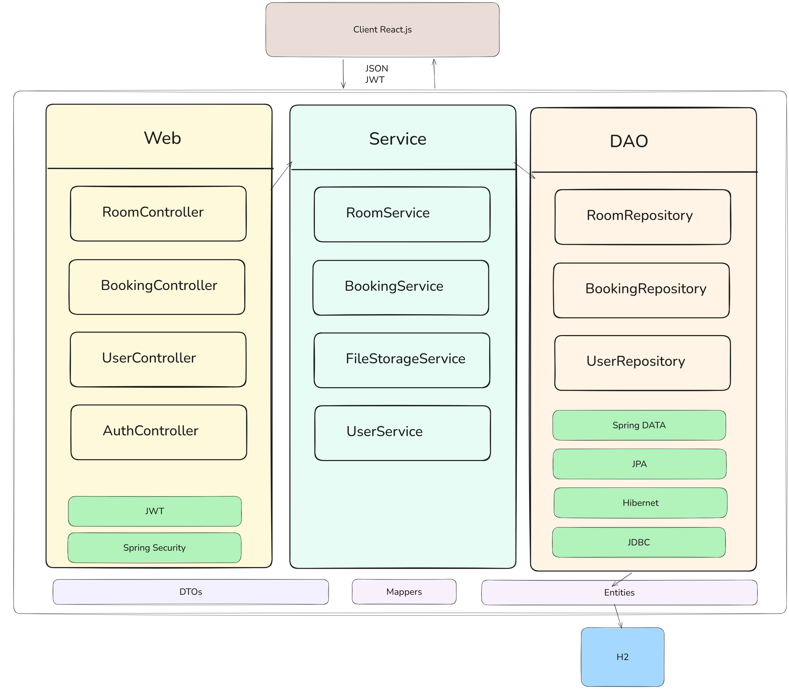

# Itran Hotel

Ce projet est une application web complète pour la gestion et la réservation d'un hôtel nommée **Itran Hotel**. Elle inclut deux parties principales :
- **Backend** : développé en **Spring Boot** (Java)
- **Frontend** : développé en **React.js**

## Table des matières
- [Fonctionnalités](#fonctionnalités)
- [Architecture de projet ](#Architecture-de-projet)
- [Installation et démarrage](#installation-et-démarrage)
    - [Backend Spring Boot](#backend-spring-boot)
    - [Frontend React.js](#frontend-reactjs)
- [Aperçu des modules](#aperçu-des-modules)
- [Dépendances principales](#dépendances-principales)
- [Capture d'écran](#capture-décran)
- [Crédits](#crédits)

---

## Fonctionnalités

- Authentification/inscription utilisateur/admin
- Recherche de chambres disponibles avec filtres par type, date, etc.
- Réservation de chambres
- Gestion des réservations (création, édition, annulation)
- Tableau de bord administrateur :
  - Gestion/création/édition/suppression de chambres
  - Gestion des réservations clients
- Gestion de profil utilisateur

## Architecture de projet 




## Installation et démarrage

### Backend Spring Boot

1. Rendez-vous dans le dossier backend :
   ```bash
   cd backend
   ```
2. Configurez la base de données dans `application.properties` (variables de connexion, etc.).
3. Compilez et démarrez l'API :
   ```bash
   ./mvnw spring-boot:run
   ```
   Le backend tournera en général sur `http://localhost:8085` (ou le port configuré).

### Frontend React.js

1. Rendez-vous dans le dossier frontend :
   ```bash
   cd frontend
   ```
2. Installez les dépendances npm :
   ```bash
   npm install
   ```
3. Lancez le serveur de développement :
   ```bash
   npm start
   ```
   Le front sera accessible par défaut sur `http://localhost:3000`

## Aperçu des modules

- **Accueil et présentation de l'hôtel** (`HomePage.jsx`)
- **Recherche et résultats de chambres** (`RoomSearch.jsx`, `RoomResult.jsx`)
- **Réservation d'une chambre** (`RoomDetailsPage.jsx`)
- **Trouver une réservation (pour utilisateur)** (`FindBookingPage.jsx`)
- **Gestion Admin** :
    - Ajout d'une chambre (`AddRoomPage.jsx`)
    - Modification/Suppression de chambres
    - Gestion des réservations (`ManageBookingsPage.jsx`)
- **Gestion du profil utilisateur** (`ProfilePage.jsx`, `EditProfilePage.jsx`)
- **Navigation et mise en page** (`Navbar.jsx`, `Footer.jsx`)

## Dépendances principales

- **Frontend** :
    - React
    - react-router-dom
    - react-datepicker
    - axios (via `ApiService.js`)
- **Backend** :
    - Spring Boot, Spring Security, JPA, Hibernate, Spring validation, lombok, 
    - Base de données (MySQL, H2 à configurer)
    - JWT pour l’authentification (à confirmer dans le backend) Spring security

## Capture d’écran


## Crédits

- Projet développé par [d-sar](https://github.com/d-sar)
- Toute contribution ou suggestion d'amélioration est la bienvenue !


